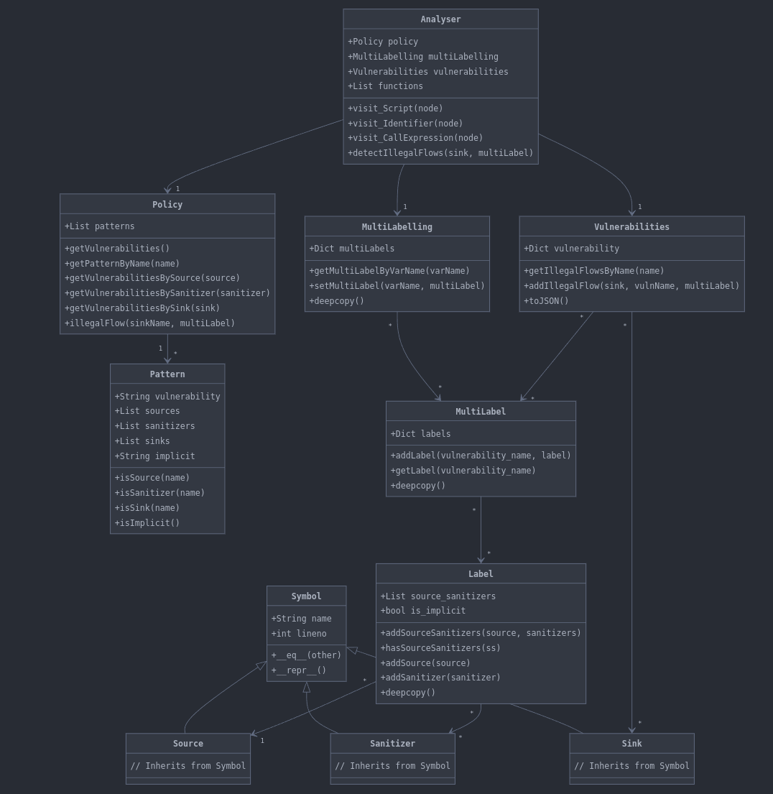

# Discovering vulnerabilities in Javascript web applications - Group51

## Description

A large class of vulnerabilities in applications originates in programs that enable user input information to affect the values of certain parameters of security sensitive functions. In other words, these programs encode a potentially dangerous information flow, in the sense that low integrity -- tainted -- information (user input) may interfere with high integrity parameters of sensitive functions **or variables** (so called sensitive sinks). This means that users are given the power to alter the behavior of sensitive functions **or variables**, and in the worst case may be able to induce the program to perform security violations. For this reason, such flows can be deemed illegal for their potential to encode vulnerabilities.

It is often desirable to accept certain illegal information flows, so we do not want to reject such flows entirely. For instance, it is useful to be able to use the inputted user name for building SQL queries. It is thus necessary to differentiate illegal flows that can be exploited, where a vulnerability exists, from those that are inoffensive and can be deemed secure, or endorsed, where there is no vulnerability. One approach is to only accept programs that properly sanitize the user input, and by so restricting the power of the user to acceptable limits, in effect neutralizing the potential vulnerability.

JavaScript has been the primary language for application development in browsers, but it is increasingly becoming popular on server side development as well. However, JavaScript suffers from vulnerabilities, such as cross-site scripting and malicious advertisement code on the client side, and SQL injection on the server side.

The aim of this project is to study how web vulnerabilities can be detected statically by means of taint and input sanitization analysis. We choose as a target web server and client side programs encoded in the JavaScript language.

A detailed description of the project can be found [here](./statement.md).

## Table of Contents

- [Discovering vulnerabilities in Javascript web applications - Group51](#discovering-vulnerabilities-in-javascript-web-applications---group51)
  - [Description](#description)
  - [Table of Contents](#table-of-contents)
  - [Installation](#installation)
  - [Usage](#usage)
  - [Testing](#testing)
  - [Structure](#structure)
  - [Recommended Reading](#recommended-reading)

## Installation

To install the project, you need to clone the repository:

```bash
git clone git@gitlab.rnl.tecnico.ulisboa.pt:ssof2425/project/project-groups/Group51.git
```

Then, you need to create a virtual environment and install the dependencies:

```bash
python3 -m venv venv
source venv/bin/activate
pip install -r requirements.txt
```

To setup logging, create a `.env.example` and rename it to `.env`. Set the `LOG_LEVEL` to `DEBUG` (enable debug logging) or `INFO` (disable debug logging).

```bash
cp .env.example .env
```

To enable pre-commit hooks to format the project at commit time, run the following command:

```bash
pre-commit install
```

## Usage

To run the project, you can use the following command:

```bash
python3 js_analyser.py <path-to-js-file> <path-to-patterns-file>
```

To validate the output of the analysis, you can use the following command:

```bash
python3 validate.py -o output.json -t <path-to-supposed-output-file>
```

## Testing

To facilitate testing, we have created a bash script that runs the analysis on all the test cases and validates the output. To run the tests, you can use the following command:

```bash
./run_test.sh
```

The script accepts the following options:

```txt
./run_test.sh [--stop] [--keep] [--slice=<name>.js]
--stop: Stop the script if a test fails
--keep: Keep the validation_output.txt and output.json files after the script finishes
--slice=<name>.js: Run a single file
```

## Structure

Here you can see how our code is structured:



Here's a breakdown of the main components:

1. Core Symbol Classes:
- **Symbol** is the base class for **Source**, **Sink**, and **Sanitizer**
- Each of these classes represents a different type of program element to analyze

2. Pattern and Policy:
- **Pattern** defines vulnerability patterns with sources, sinks, and sanitizers
- **Policy** manages multiple patterns and handles vulnerability detection rules

3. Labeling System:
- **Label** tracks sources and sanitizers for specific code elements
- **MultiLabel** manages multiple labels for different vulnerability types
- **MultiLabelling** maps variable names to their associated labels

4. Analysis:
- **Analyser** is the main class that performs the code analysis. It uses the Policy, MultiLabelling, and Vulnerabilities classes to track and detect security issues
- Implements visitors for different types of Esprima nodes

5. Results:
- **Vulnerabilities** stores and manages detected vulnerability information
- Can export results to JSON format


## Recommended Reading

The following resources are recommended for further reading:

- C. Staicu et. al, [An Empirical Study of Information Flows in Real-World JavaScript](https://www.cse.chalmers.se/~andrei/plas19.pdf), PLAS'2019.
- C. Staicu et. al, [Extracting Taint Specifications for JavaScript Libraries](https://cs.au.dk/~amoeller/papers/taser/paper.pdf), CSE'20.
- S. Guarnieri et. al, [Saving the World Wide Web from Vulnerable JavaScript](https://sammyg.org/Work/Actarus/actarus.pdf), ISSTA'11 and the companion [IBM JavaScript Security Test Suite](https://researcher.watson.ibm.com/researcher/view_page.php?id=1598).
